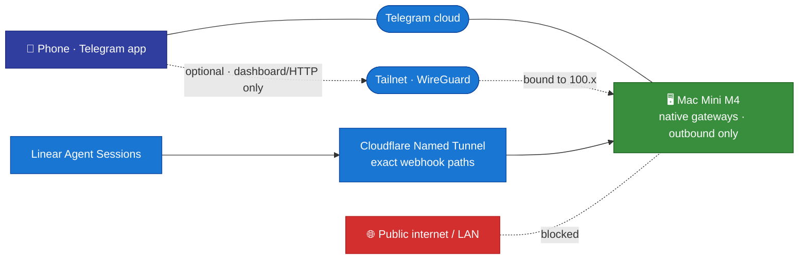

# Networking — Telegram & (optional) Tailscale

[← All docs](../README.md)

---



## 8. Networking

Everything runs on **one machine** (the Mac Mini M4), and the primary interface is **Telegram**. That changes the networking story completely from the old two-machine, container-per-agent draft.

### 8.1 Telegram needs no inbound ports and no Tailscale

Each native gateway connects **outbound** to Telegram via **long polling**. Telegram's own infrastructure relays your messages, so Telegram access works from anywhere without an inbound Telegram port and without Tailscale. Telegram's webhook mode is not used.

The production fleet has one separately approved inbound exception: Linear Agent Session webhooks. Cloudflare Named Tunnel `hermes-linear` routes each profile's exact public `/linear/webhook` path to a dedicated loopback listener (`127.0.0.1:8787–8793,8796–8797`). Unmatched paths terminate at `404`; unsigned webhook POSTs return `401`; webhook GET returns `405`. Cloudflare Access is not placed in front of these vendor callbacks because Linear cannot complete an interactive challenge. The former Tailscale Funnel sidecar is retired and is not a fallback. Tailscale remains private/admin mesh and Remote Desktop transport.

Because agent-to-agent communication is now **local** (same install — see [Section 17](12-agent-comms.md)), there is also **no inbound network path between agents** to secure. The old per-gateway HTTP API + Tailscale mesh existed to let containers on two machines talk; that requirement is gone.

### 8.2 Tailscale is optional — only for the dashboard or raw HTTP API

You only need Tailscale if you turn on a feature that **listens** and you want to reach it from your phone/laptop:

- the **Hermes web dashboard** (a browser fleet console — see 8.2.1)
- the **HTTP API server** for an external (non-Telegram) client

These are privileged administration surfaces. Current dashboard releases enforce session-token and Host/peer checks on loopback and require an auth provider for a non-loopback bind. Preserve those controls; **do not expose the studio dashboard publicly**. Any remote-access change needs its own approved authentication and network design.

If you never enable the dashboard or HTTP API, skip their Tailscale setup below. The approved Linear Cloudflare ingress is independent of those optional human/admin surfaces.

#### 8.2.1 The web dashboard — build, multi-profile, persistence

The dashboard is **one console for the whole fleet**, not one-per-agent: the UI has a profile **list + switcher** (`/api/profiles`, `/api/profiles/active`) and a **unified sessions view aggregated across all profiles**, plus per-profile config / API-key editing and create/delete. The `-p <slug>` flag only sets which profile is *selected on load*. Config/keys stay *stored* per-profile (that's the isolation); the dashboard is just one window onto all of them. (Cross-*agent* activity is the kanban board's job — separate, and CLI/TUI only.)

Pin the dashboard executable and its web/TUI assets to the **same tested source commit**. The dashboard is separate from Desktop's backend, the SDK server and the messaging gateways; repairing it does not require moving their runtime selectors or restarting them. A managed-looking symlink is not proof of Python provenance: verify the console-script shebang, `sys.prefix` and imported `hermes_cli`/`tools.skills_sync` paths at the final release path. Do not execute the Homebrew wrapper or serve a mutable development checkout.

For a sealed release that lacks frontend bundles, build from a detached worktree of that exact commit using its lockfile and a Node/npm version satisfying its engines. Do not install dependencies into the sealed Python release or regenerate pins:

```bash
# From the exact-commit build worktree, with compatible node/npm on PATH:
npm ci --workspace web --workspace ui-tui --workspace ui-tui/packages/hermes-ink \
  --include-workspace-root --no-audit --no-fund
npm run build --workspace web
npm run build --workspace ui-tui
npm test --workspace web
```

Copy and byte-verify `hermes_cli/web_dist/` into a commit-addressed managed asset directory, and `ui-tui/dist/entry.js` into its `tui/dist/entry.js`. Keep the build worktree out of production paths. Preserve a manifest binding source commit, asset hashes, compatible toolchain and the exact Python release. `HERMES_WEB_DIST` names the directory containing `index.html`; `HERMES_TUI_DIR` names the directory containing `dist/entry.js`.

For the candidate, choose an **actually free loopback port**. `9120` may already belong to the independent SDK server. Pass `--isolated`: current named-profile launches otherwise route to an already-listening machine dashboard and may exit successfully without starting the intended candidate.

```bash
# RUNTIME, ASSETS and NODE_BIN are already-verified absolute managed paths;
# CANARY_PORT is a checked-free port, not the SDK or Desktop backend port.
env HERMES_HOME="$HOME/.hermes/profiles/general" \
  HERMES_WEB_DIST="$ASSETS" HERMES_TUI_DIR="$ASSETS/tui" \
  PATH="$NODE_BIN:/usr/bin:/bin:/usr/sbin:/sbin" \
  "$RUNTIME/venv/bin/hermes" -p general dashboard --isolated --skip-build \
  --no-open --host 127.0.0.1 --port "$CANARY_PORT"
```

`--isolated` controls launch routing, not a new security boundary; the UI still provides the profile switcher. Keep requests explicitly scoped with `?profile=general`. Preserve existing auth and credential policy; do not add `--insecure`, expose a public listener or edit other profiles as part of the repair.

After candidate checks, retain the exact original plist and runtime/assets for rollback. Update only `~/Library/LaunchAgents/ai.hermes.dashboard.plist`: absolute commit-pinned `ProgramArguments[0]`, `-p general dashboard --isolated --skip-build --no-open --host 127.0.0.1 --port 9119`, and explicit `HERMES_HOME`, `HERMES_WEB_DIST`, `HERMES_TUI_DIR`, compatible `PATH`. Preserve `RunAtLoad`, `KeepAlive`, log destinations and login-session policy. Lint the plist, reload only `ai.hermes.dashboard` through launchd, and inspect registration/readiness rather than relying on a blind drain sleep. Stop the session-owned canary after production verification.

Required read-back is more than HTTP 200: launchd PID and executable identity; actual `127.0.0.1:9119` listener; root HTML and referenced asset bytes; authenticated profile API; missing/invalid session-token rejection; hostile Host-header rejection; rendered UI and Chat/PTY startup as applicable; stable process identity and no new error/retry loop. Do not persist session tokens. Report dashboard component health separately from the custom gateway/SDK health. On regression restore the retained plist, reload only this job and verify recovery. Future upgrades move the dashboard's runtime and matching asset coordinates together, not an unrelated shared symlink.

### 8.3 If you do enable a listener — bind it to Tailscale

Install Tailscale on the Mini and your phone (`brew install --cask tailscale`), sign in to the same tailnet, give the Mini a stable hostname (`hermes-mini`), enable MagicDNS.

```bash
tailscale status
tailscale ip -4          # the Mini's tailnet IP, 100.x.y.z
```

Native, there is **no Docker `-p` to bind a host IP** — you bind inside Hermes config. For a profile that exposes the API server or dashboard, in its `config.yaml`:

```yaml
api_server:
  enabled: true
  host: "100.x.y.z"          # the Mini's Tailscale IP — NOT 0.0.0.0, NOT the LAN IP
  port: 8642
  key: "<openssl rand -hex 32>"   # always set a key, even behind Tailscale
```

Binding `host` to the tailnet IP makes the listener reachable from your tailnet devices and **invisible to the LAN and the public internet**. Set a `key` regardless — Tailscale is the network boundary, the key is the application boundary; if a tailnet device is compromised the attacker still needs the key. Generate one per profile (`openssl rand -hex 32`).

For HTTPS (needed to PWA-install a dashboard on your phone), bind the **dashboard** to loopback (`host: "127.0.0.1"`, port `9119`) and let `tailscale serve` terminate TLS in front of it:

```bash
tailscale serve --bg --https=443 http://127.0.0.1:9119
```

(Use this loopback-plus-`tailscale serve` pattern for the dashboard; the direct tailnet-IP bind above is for the API server when you don't want a TLS front. Don't bind a service to the tailnet IP *and* point `tailscale serve` at `localhost` — pick one.)

### 8.4 Verifying the bind (only if you exposed something)

After enabling a listener, confirm it is **not** on `0.0.0.0`:

```bash
# Should show the Tailscale IP, NOT 0.0.0.0 or *
sudo lsof -iTCP -sTCP:LISTEN -P -n | grep -E '8642|9119'
```

External smoke test from a device **not** on the tailnet (cellular, Tailscale off):

```bash
curl http://<mini-public-ip>:8642/health   # must fail / time out
```

If that succeeds, you have a public-facing agent — stop and fix the `host` binding before continuing.

### 8.5 Risks worth knowing

- **Telegram itself exposes no listener.** The production Linear exception is limited to nine exact Cloudflare hostname/path routes terminating on loopback; dashboard and raw HTTP API stay private.
- **Tailscale ACLs are off by default** ("all tailnet members reach all ports"). Fine for a personal tailnet; tighten in the admin console for a shared one (work/family).
- **Tailscale IP can change** if you remove/rejoin the tailnet. MagicDNS hostnames are more stable than raw IPs; re-bind config if it changes.
- **Telegram bot tokens are the real perimeter.** Since Telegram is the front door, a leaked bot token = a path to that agent. Keep each token canonical in its persona-scoped 1Password item, map it only to that profile, and restrict each bot to your user ID (Sections 4, 9 and 15).

---
